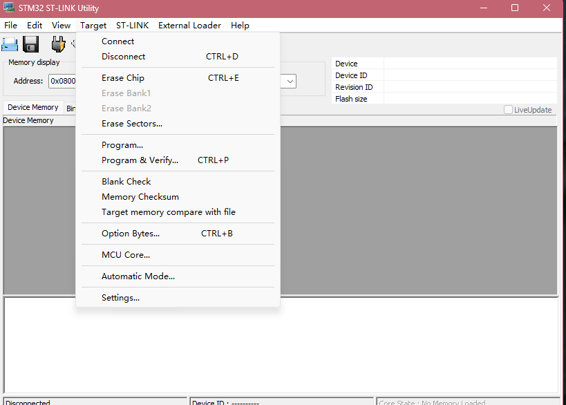
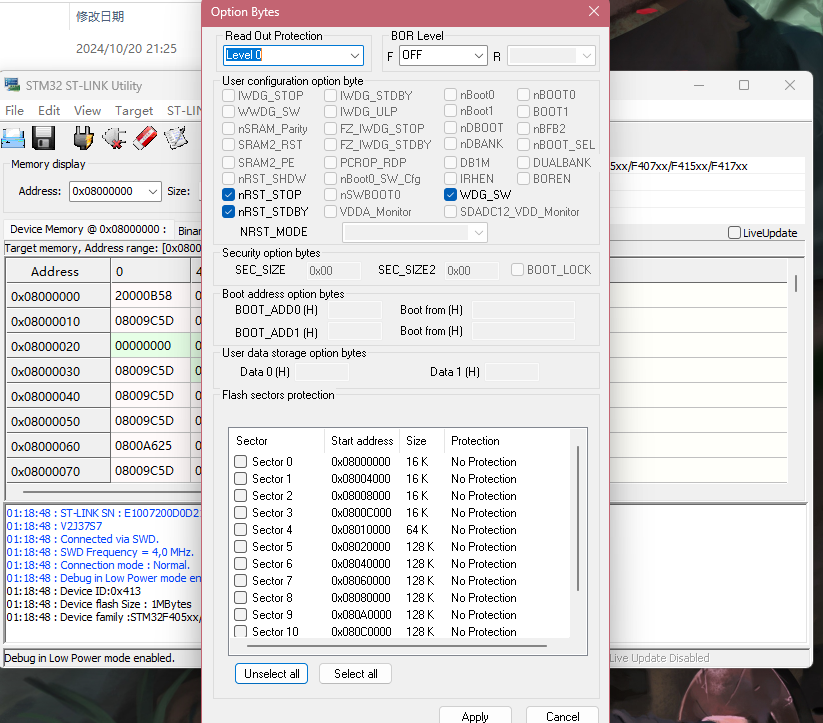

+++
title = 'STM32单片机被锁'
date = 2026-04-22T10:52:45+08:00
categories = ["嵌入式","单片机","STM32"]
+++
# STM32芯片被锁

###### 移植rt-thread卡了很久没成功，最后发现是芯片锁住了程序下不进去

我觉得可能是使用pyocd下载程序，第一次用了较低版本下载导致锁住了，换新版下载就一直失败了，知道解锁之后才能下进去程序。

[STM32芯片被锁住， 10秒解锁Flash_哔哩哔哩_bilibili](https://www.bilibili.com/video/BV1WY4y1b79Z/?spm_id_from=333.788.top_right_bar_window_history.content.click&vd_source=e860cbec547aae4a28e2232f90796889)

下载失败应该考虑是不是flash被锁住了

用st-link连接， ST-LINK Utility

target里面connect，连接好后再点option bytes

在这里当时我是Level 1

RDP（read out protection）

**1、Level 0（无保护）**

  默认设置，所有读写和擦除操作都可以正常支持。

2、Level 1 （Flash连接保护）

（1）可以防止连接调试器时读取Flash内容，或者RAM中存有恶意获取代码，也是禁止的。

（2）如果没有检测到从内部RAM启动，从系统bootloader启动且没有连接调试器，对用户Flash的读写和擦除操作都是允许的，并且其它安全存储区也是可以访问的。否则是禁止访问的，一旦检测到对Flash的读请求，将产生总线错误。

（3）如果将Level 1切换到Level 0时，用户Flash区和安全区域将被删除。

3、Level 2（设备保护和自举保护）

（1）所有调试特性被关系。
（2）禁止从RAM启动。
（3）除了选项字节里面的SWAP位可以配置，其它位都无法再更改。
（4）禁止了调试功能，且禁止了从RAM和系统bootloader启动，用户Flash区是可以执行读写和擦除操作的，访问其它安全存储区也是可以的。

特别注意：**Level2修改是永久性的，一旦配置为Level2将不再支持被修改。**

