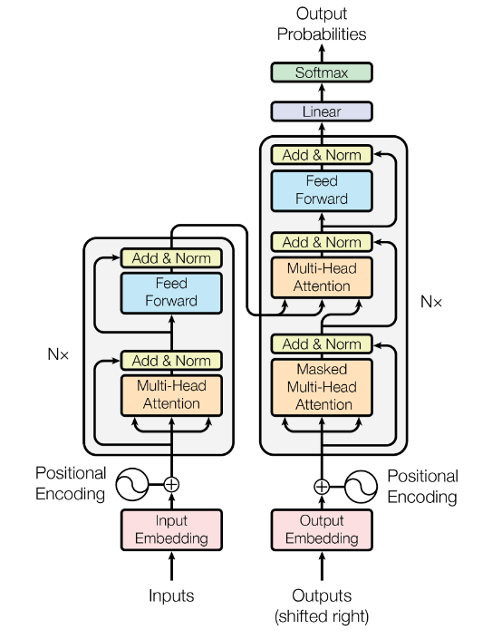
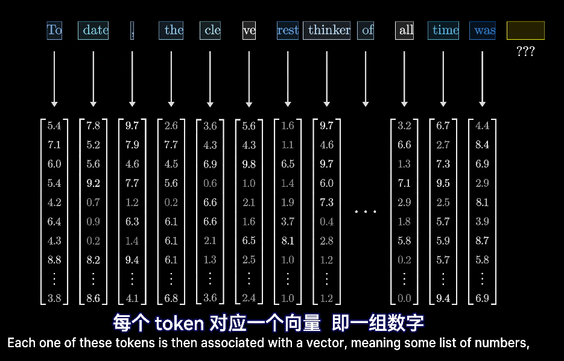
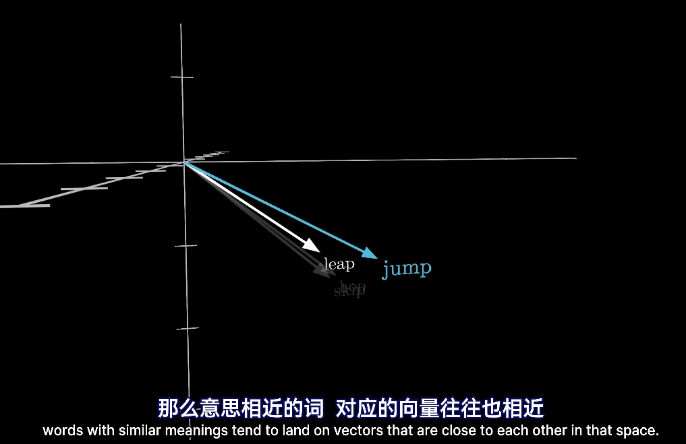
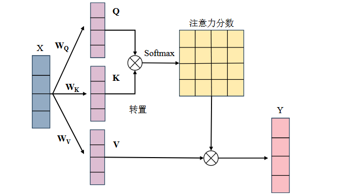

+++
title = 'Transformer架构学习'
date = 2026-05-01T01:35:24+08:00
categories = ["深度学习", "经典模型"]
+++

Transformer架构学习，基于动画教程理解和GPT问答，我的毕设只涉及了他的多头自注意力机制，所以本文没有涉及译码器部分。

## 总结构图

一个完整的 Encoder Block 的内部结构：
$$
X \rightarrow MultiHeadAttention \rightarrow Add\&Norm \rightarrow FFN \rightarrow Add\&Norm
$$

## Transformer 流程起点——词嵌入Embedding

 输入的 token 首先经过 embedding 层，将离散的 token 映射为连续向量，用于编码语义信息。每个 token 对应 embedding 矩阵的一行，形成一个 $d$ 维向量，也就是一组数字：
$$
x_i \in \mathbb{R}^d
$$
 这些向量作为模型后续计算（如 Attention）的基础输入。

------

### 🔹 Embedding 矩阵

 Embedding 矩阵记作：
$$
W_e \in \mathbb{R}^{V \times d}
$$

 - **V**：词表大小（行数，由人为设定的超参数）

 - **d**：向量维度（列数，由人为设定的超参数）

​	矩阵的每一行对应一个 token 的向量表示，初始值随机生成，不是人为编码，而是**模型的第一层权重**。在训练过程中，embedding 会通过梯度优化不断更新，使得语义相似的 token 在向量空间中距离更接近。

 常见 d 值：

 - 小模型：128 / 256
 - 中等模型：512 / 768
 - GPT-3：12288

 维度 d 决定 token 的表示能力，同时影响参数量 $V \times d$ 和计算成本。

------

### 🔹 实现机制

**输入不是**整个 Embedding 矩阵 $W_e$，而是当前 token ids 从 $W_e$ 中查表得到的 embedding 向量序列。

 Embedding 实质上是查表（lookup）操作：
$$
 x_i = W_e[\text{id}_i]
$$

 - 每个 token 的 id 用来索引 **embedding 矩阵**的一行

 - 得到对应的向量表示

   > 这意味着 embedding 不是预处理，而是模型可训练的一部分，通过训练学习语义表示

   说是要把token对应成向量，通过查表来，表怎么来的？表就是 **embedding 矩阵**

   查表操作本质上等价于 one-hot 向量与 embedding 矩阵相乘：
   $$
   X_{emb}=OW_e
   $$
   实际实现中不会真的构造 one-hot 矩阵，而是直接用 token id 索引 $W_e$ 的对应行。

------

### 🔹 类比理解

 可以把 embedding 理解为：

 - **加密**：将 token 编码成向量信号，在模型内部进行处理
 - **解码（unembedding）**：通过输出层将向量映射回词表概率，实现 token 的预测

------

### 🔹 总结

 **Embedding 层通过查表将每个 token 映射为一个 d 维向量，矩阵维度由超参数 V 和 d 决定，向量初始随机，在训练过程中学习语义表示，是 Transformer 输入处理的第一步核心参数。**

数据可视化之后就是，越相近的两个词，位置越接近。

👉**语义相似的词，在向量空间中距离更近**

⚠ 但注意：这不是人为编码的，属于权重，是训练过程中自动学习得到的

原因：

> 相似词出现在相似上下文中，模型为了降低预测误差，会将它们的向量拉近

向量方向相近，点积为正

## 起点第二步——位置编码

🔹位置编码矩阵 PE

**位置编码矩阵 PE** 不是 $V \times d$，这是 **Embedding 参数矩阵**，也就是“总表”。但是输入不是所有表里的数，而是：
$$
PE \in \mathbb{R}^{n \times d}
$$
其中：

- $n$：当前输入序列长度，也就是这句话/这段文本里有多少个 token
- $d$：每个 token 向量的维度，必须和 embedding 的 $d$ 一样，才能相加

embedding 只把 token 变成了向量，但它本身**不知道 token 的顺序**。也就是说，单看 embedding，模型只知道有哪些 token，不天然知道谁在前、谁在后。

所以 Transformer 会在 embedding 向量上加入位置信息：
$$
X = \text{Embedding} + \text{Positional Encoding}
$$
原始 Transformer 用的是正弦/余弦编码：
$$
PE_{pos,2i}=\sin\left(\frac{pos}{10000^{2i/d}}\right)
$$

$$
PE_{pos,2i+1}=\cos\left(\frac{pos}{10000^{2i/d}}\right)
$$

其中：

- $pos$：token 在序列中的位置，比如第 0 个、第 1 个、第 2 个（列）
- $i$：向量维度的索引（行）
- $d$：embedding 维度

也就是说，每个 token 的最终输入向量变成：
$$
\text{token语义信息} + \text{位置信息}
$$

## ⭐自注意力机制（单头）

此时的输入：
$$
X = X_{emb} + PE
$$
此时 $X$ 已经包含了：**token 的语义信息 + token 的位置信息**

 **⚠特别注意：**Q，K，V不是人为定义的标签，而是这些矩阵在公式中的**功能性解释**。

### 🔹 实现机制

接下来，模型会用这个 $X$ 生成三组矩阵：
$$
Q = XW_Q
$$

$$
K=XW_K
$$

$$
V = XW_V
$$

其中功能性解释：

- $Q$：Query，表示“我要找什么”
- $K$：Key，表示“我有什么特征可以被匹配”
- $V$：Value，表示“真正要被加权汇总的信息内容”

它们的**矩阵形状是人为设定的超参数决定的**，比如：
$$
W_Q \in \mathbb{R}^{d \times d_k}
$$
其中：

- $d$：输入向量维度，是超参数
- $d_k$：Q/K 的投影维度，也是设计时确定的，要注意$$V$$不一样
- 矩阵里的每一个数值：训练得到

$$X$$ 分别乘上三个可训练权重矩阵得到: 
$$
Q \in \mathbb{R}^{n \times d_k}
$$

$$
K \in \mathbb{R}^{n \times d_k}
$$

$$
V \in \mathbb{R}^{n \times d_v}
$$

这一步的核心作用是：

**把同一个输入 $X$ 投影到三个不同的表示空间，为后面计算注意力权重做准备。**

然后进入注意力计算：
$$
Attention(Q,K,V)
=
softmax\left(\frac{QK^T}{\sqrt{d_k}}\right)V
$$
图解：

$$Y=Attention(Q,K,V) $$是“融合上下文后的 token 表示”，每个 token 的新向量都包含了它根据注意力权重从其他 token 中提取到的信息。

分析这个公式，首先是
$$
QK^T
$$

### Q和K的意思也是人为理解的啊，为了方便理解这么说但实际都是黑盒吧，除了左乘和右乘的区别外没别的区别

**实际：**就是左乘和右乘的区别决定了他们的功能性解释

更准确地说：
$$
(QK^T)_{ij}=q_i\cdot k_j
$$
这里的结构规定了：**第 $i$ 个 token** **的** $q_i$ 会和**所有 token 的** $k_j$ 做匹配，**得到第 $i$ 行注意力分数**。随后 softmax 按行归一化，所以第 $i$ 行表示“第 $i$ 个 token 对所有 token 的关注分布”。

每个token**的 Q 向量**对其余所有token的**K 向量**(特征)去做匹配**(内积)**

由这个公式引出以下问题：

### 1. Q的功能性解释怎么理解

Q 就是当前 token 用来和别人比较的那套特征。通过训练，模型学会了把当前 token 转换成什么样的 $Q$，才能更好地和其他 token 的 $K$ 进行相关性匹配，所以它被称为 Query。

### 2. K的功能性解释怎么理解

K 是每个 token 提供给别人匹配用的特征表示。

### 3. V的功能性解释怎么理解

前面 Q 和 K 只是用来算“相关性/权重”：
$$
A=softmax\left(\frac{QK^T}{\sqrt{d_k}}\right)
$$
这里得到的 $A$ 是注意力权重，表示：

> 每个 token 应该关注哪些 token，以及关注多少。

但注意：
 **Q 和 K 算完权重以后，并不直接作为输出内容。**

真正被加权求和的是 V：
$$
Attention(Q,K,V)=AV
$$
也就是：
$$
Y_i=\sum_{j=1}^{n}A_{ij}v_j
$$
这个公式的意思是：

> 第 $i$ 个 token 的新表示$Y_i$，是根据注意力权重 $A_{ij}$，从所有 token 的 $V$ 向量中加权汇总出来的。

所以 V 的作用就是：**被注意力权重选中后，真正贡献给输出的内容。**

### 为什么叫自注意力机制，和注意力机制的区别？

关键在这个“自”字：它是在**序列内部自己和自己做匹配**

> **Q、K、V 都来自同一个输入序列 $X$。**

也就是：
$$
Q=XW_Q,\quad K=XW_K,\quad V=XW_V
$$
所以它是在**序列内部自己和自己做匹配**：
每个 token 都拿自己的 $Q$，去和同一句话/同一段输入里所有 token 的 $K$ 匹配，然后再融合这些 token 的 $V$。

因此叫：

> **Self-Attention = 输入序列内部的 token 之间互相注意。**

------

普通“注意力机制”是一个更大的概念，不一定 Q/K/V 都来自同一个序列。没学过其他的注意力机制，暂时不写。

## ⭐⭐⭐多自注意力机制

单头注意力可以理解为：**模型用一套 Q/K/V 匹配方式，计算 token 之间的关系，并融合信息。**

但是一套匹配方式可能不够。不同 token 之间可能存在多种关系，比如局部关系、远距离关系、语义关系、时序变化关系等。所以 Transformer 不只做一次 attention，而是并行做多次 attention。

所以要把Q/K/V 矩阵细分成多个权重矩阵去各自训练。

### 多头注意力的核心思想

多头注意力就是：

> 用多组不同的 $W_Q, W_K, W_V$，把同一个输入 $X$ 投影到多个不同子空间中，分别计算注意力。

$$
d_k = d_v = \frac{d}{h}
$$

第 $r$ 个 head 可以写成：
$$
Q_r=XW_Q^{(r)}
$$
然后：
$$
head_r=Attention(Q_r,K_r,V_r)
$$
每个 head 都会得到一个自己的注意力输出。

### 为什么要多个 head？

因为每个 head 的参数不同，所以它们可以学到不同的匹配方式。

比如在文本里：

一个 head 可能更关注主谓关系，另一个 head 可能更关注上下文呼应，还有一个 head 可能更关注局部相邻词。

如果放到毕设那种时序/特征建模场景里，可以理解为：

一个 head 可能关注局部退化特征，另一个 head 可能关注长期趋势，还有一个 head 可能关注某些关键时间片段。

**注意：这不是人为规定的，而是训练中学出来的。**

### 多个 head 怎么合并？

假设有 $h$ 个 head：
$$
head_1, head_2, \dots, head_h
$$
先拼接：
$$
Concat(head_1,head_2,\dots,head_h)
$$
然后再乘一个输出权重矩阵：
$$
MultiHead(X)=Concat(head_1,\dots,head_h)W_O
$$
这里的 **$W_O$ 也是训练出来的参数**。

它的作用是：**把多个 head 学到的信息重新融合，变回统一的输出表示。**

### 总结：

​	使用多套 Q/K/V，让模型从**多个子空间、多个角度学习 token 之间的关系**，最后再把多个 head 的结果拼接并线性融合。

## ⭐Add&Norm

 Transformer 不会直接把 $Y$ 丢给下一层，而是做一步：
$$
Y’ = LayerNorm(X + Y)
$$
这里有两个操作：

**残差连接（Add）**：把原始输入 $X$ 加回去。
$$
X + Y
$$
使模型在融合注意力信息时，不完全丢掉原始输入，避免信息在多层网络中被破坏，也让深层网络更容易训练。

**层归一化（Norm）**：对加完后的结果做归一化，让数值分布更稳定。
$$
LayerNorm(X + Z)
$$
它的作用是让训练更稳定，避免每一层输出的数值范围变化太大。

**多头注意力负责融合上下文信息，Add & Norm 负责保留原始信息并稳定训练。**

## ⭐ FFN

前面多头注意力已经完成了：
$$
X \rightarrow MultiHeadAttention \rightarrow Add\&Norm
$$
得到一个融合了上下文信息的新表示。接下来，Transformer 会对每个 token 的向量再**单独**做一次非线性变换，这一步就是 FFN。

它的典型形式是：
$$
FFN(x)=W_2\sigma(W_1x+b_1)+b_2
$$
这里：

- $W_1, W_2$：可训练权重
- $\sigma$：激活函数，原论文用 ReLU，后来很多模型用 GELU
- $x$：某个 token 的向量表示

作用：Attention 负责让 token 之间交换信息，FFN 负责**对每个 token 自己**的特征进行进一步加工和提炼。

​	FFN 是逐 token 独立处理的，不会让不同 token 之间直接交互。不同 token 之间的信息交互已经在前面的 self-attention 里完成了。

后面还会再接一次 Add & Norm：

此后一个完整的 **Transformer Encoder Block** 可以写成：
$$
Y = LayerNorm(X + MultiHeadAttention(X))
$$

$$
Output = LayerNorm(Y + FFN(Y))
$$

## ⭐Encoder 堆叠

把“多头注意力 + FFN + 两次 Add&Norm”作为一个**编码器块**，重复多层，得到更高层的上下文特征表示。

这只是**一层编码器块**。真正的 Transformer Encoder 通常会把这个结构重复堆叠 $N$ 次：
$$
X \rightarrow EncoderBlock_1 \rightarrow EncoderBlock_2 \rightarrow \cdots \rightarrow EncoderBlock_N
$$
原始 Transformer 里 $N=6$，BERT-base 里 $N=12$，但具体层数也是人为设定的超参数。

最后 Encoder 的输出仍然是一个矩阵：
$$
H \in \mathbb{R}^{n \times d}
$$
其中每一行仍然对应一个 token/时间步/特征位置，只不过它已经不是最初的 embedding，**而是经过多层注意力和 FFN 加工后的上下文特征表示**。

## 那transformer并行计算的特点怎么展现的？

**不需要像 RNN/LSTM 那样按时间步递推**。

它不是先算第 1 个时间步，再算第 2 个时间步，而是直接通过矩阵乘法同时计算所有时间步之间的关系。

所以 Transformer 的并行性体现在：
$$
\text{一次矩阵运算} \Rightarrow \text{同时得到所有时间步之间的注意力关系}
$$

## 问题

为什么有残差连接这条路？
残差连接——输入+归一化

相当于把输入加上模型训练后的输出，再归一化。
这样不管第一个模块训练的怎么样，后面还是能把原始的输入信息继续往下带。
归一化让数值更趋于稳定，方便训练

FNN——前馈神经网络   全连接层
利用激活函数增强模型的非线性表达能力，引入更多参数给它去训练

译码器部分，加mask，不能让他看到答案

Q——query（询问；疑问 发问）    K———Key     V——Value

自注意力机制————他的Q，K，V都来自于自身

K，V来自编码器，Q来自输出的输入（告诉我我该关注谁（i love））

最后的线性层预测词的得分，softmax最后将得分映射成概率——得到最终的词

并行计算的重大突破，把输入输出同时拉进去训练，而不是把输入得到的输出与真实输入做对比，反馈后再重新输入，这样只有输入才参与了训练

长序列问题————不管有多长，都可以把上下文信息编码进去

用Q/K/V不相同可以保证在不同空间进行投影，增强了表达能力，提高了泛化能力。
错误：：并不是说特定名字做特定的事情

注意力核心公式：
$$
\text{Attention}(Q,K,V)=\text{softmax}\left(\frac{QK^T}{\sqrt{d}}\right)V
$$
🔹 Query（Q）
表示“我在找什么”
当前token的“查询意图”
🔹 Key（K）
表示“我有什么特征可以被匹配”
所有token的“索引标签”
🔹 Value（V）
表示“真正要被加权输出的内容”

Q/K → **只参与“权重计算”**

V → **承载“信息本体”**

$$
{QK^T}
$$
是nxn

Q,k：nx1--> nx1  x  1xn =nxn

所以得到的是各各意图与标签相乘的权重？概率？

> ##  QKᵀ 的真实含义（核心）
>
> $$
> (QK^T)_{ij} = q_i \cdot k_j
> $$
>
> 👉 解释：第 $i$ 个“意图”（Query）和第 $j$ 个“标签”（Key）的匹配分数

深度学习的本质就是带可调参数的矩阵乘法

### softmax的T

softmax的T（温度）越大，选择概率越小的，语言模型更具备创造性，但因此会失去严谨性。反之则失去创造性。

