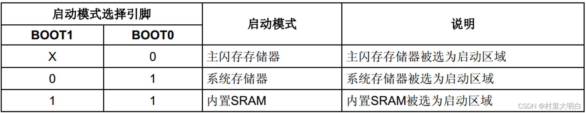

+++
title = 'STM32启动配置速查——BOOT引脚'
date = 2026-04-25T00:36:42+08:00
categories = ["嵌入式","单片机","STM32"]
+++

- 决定了处理器从哪个具体地址去获得第1条需要执行的指令

- 对于处理器来说，无论它挂接的是闪存、内存，还是硬盘，它在启动时是“一无所知”的，我们需要通过硬件设计来告诉它存储第一条指令的外设。

- STM32系列处理器的第一条执行指令地址是通过硬件设计来实现的。   

