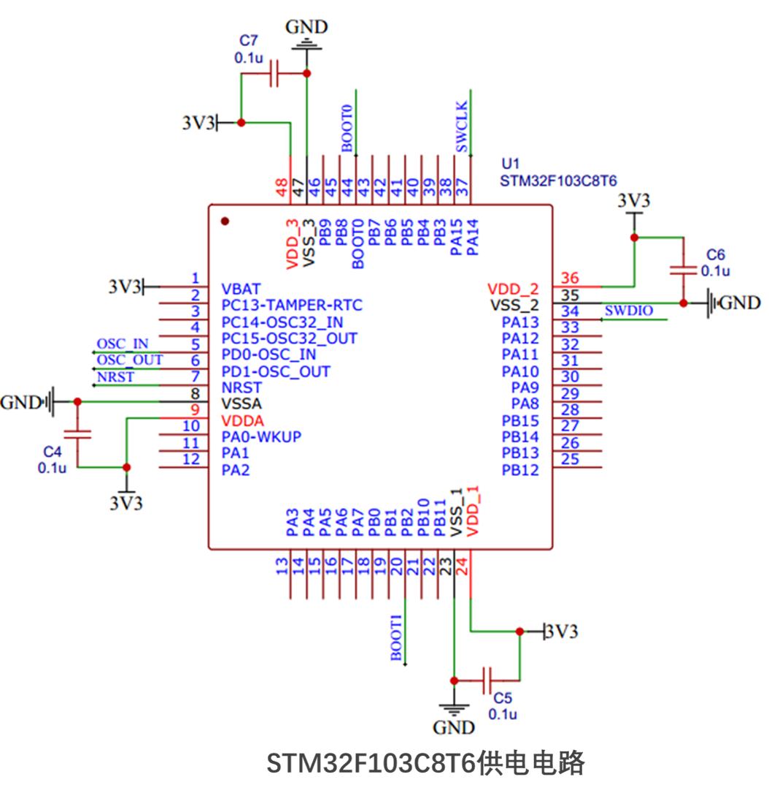
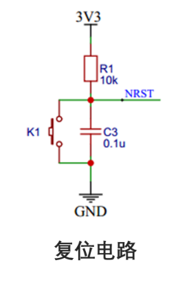
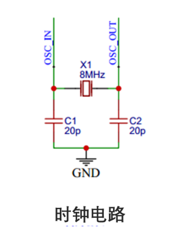
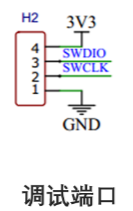
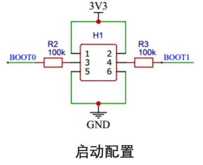

+++
title = 'STM32单片机的最小系统电路'
date = 2026-04-25T00:00:35+08:00
categories = ["嵌入式","单片机","STM32"]

+++

# 要了解最小电路的目的就是知道**哪些脚是被系统占用了**，不能自由调用

参考文档：[STM32单片机自学教程_stm32教程-CSDN博客](https://blog.csdn.net/weixin_42109443/article/details/137303466?ops_request_misc=%7B%22request%5Fid%22%3A%22422bc058503681afd8ab2f949b85ba8c%22%2C%22scm%22%3A%2220140713.130102334..%22%7D&request_id=422bc058503681afd8ab2f949b85ba8c&biz_id=0&utm_medium=distribute.pc_search_result.none-task-blog-2~all~top_positive~default-1-137303466-null-null.142^v100^pc_search_result_base9&utm_term=stm32教程&spm=1018.2226.3001.4187)

芯片型号：STM32F103C8T6

## 速查总览：

### 1. 电源电路

为STM32芯片提供工作电压的电路部分，需要3.3v，见**总览**

### 2. 复位电路

有三种复位方式，分别是上电复位、手动复位和程序自动复位

### 3. 时钟电路

​	时钟电路为STM32单片机提供时钟信号，这是单片机正常工作的基础。时钟电路通常由晶振和相关的电路组成，为单片机提供稳定的时钟频率。STM32主晶振为8MHZ，经过**倍频**后为72MHZ。

> 关于**倍频**，见时钟配置详解

### 4. 调试接口电路

​	下载程序和调试单片机的接口电路，用的是SWD

### 5. 启动配置电路——BOOT引脚

​	启动配置通常是通过STM32的BOOT引脚来实现的，这些引脚（如BOOT0和BOOT1）能够支持从内部FLASH启动、系统存储器启动以及内部SRAM启动等多种启动方式。这些启动配置决定了单片机在上电或复位后从哪个存储器区域开始执行程序。

### 启动模式
