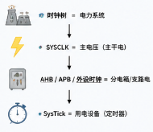

+++
title = 'RCC——STM32时钟树'
date = 2026-04-25T01:55:48+08:00
categories = ["嵌入式","单片机","STM32"]

+++

问题来源于我对时钟树，SysCLK和SysTick的混淆理解。

RCC ： reset clock control 复位和时钟控制器。  

​	MCU都是基于**时序**控制的，时序系统对MCU非常重要，因此在MCU设计时就设计了专门用于控制时序的电路，在芯片设计中称为时钟树设计。由此设计出来的时钟，可以精确控制我们的单片机 系统。一个MCU越复杂，时钟系统也会相应地变得复杂，如STM32F1的时钟系统比较复杂，不像简单的51单片机一个系统时钟就可以解决一切。

- **为什么叫时钟树而不是时钟？**

​	对于STM32F1系列的芯片，正常工作的主频可以达到72Mhz，但并不是所有外设都需要系统时钟这么高的频率，比如看门狗以及RTC只需要几十kHZ的时钟即可。同一个电路，**时钟越快功耗越大**，同时**抗电磁干扰能力也会越弱**，所以对于较为复杂的MCU一般都是采取**多时钟源**的方法来解决这些问题。所以我们称为**时钟树**而不是时钟。

> 时钟树 = 时钟源 + **处理**（PLL/分频）+ **分发**（总线/外设）

### 1. 输入时钟源

​	对于STM32F1系列单片机，输入时钟源（InputClock）主要包括四种，即**HSI**，**HSE**，**LSI**，**LSE**。其中，从时钟频率来分可以分为高速时钟源和低速时钟源，其中HIS和HSE为高速时钟，LSI和LSE是低速时钟。从来源可分为外部时钟源和内部时钟源，外部时钟源就是从外部通过接晶振的方式获取时钟源，其中HSE和LSE是外部时钟源；其他是内部时钟源，芯片上电即可产生，不需要借助外部电路。
