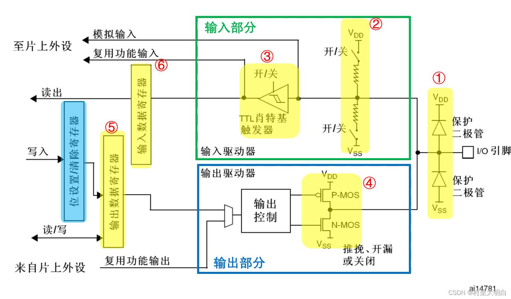
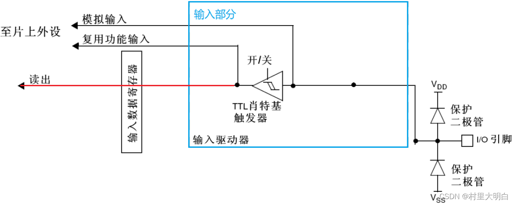
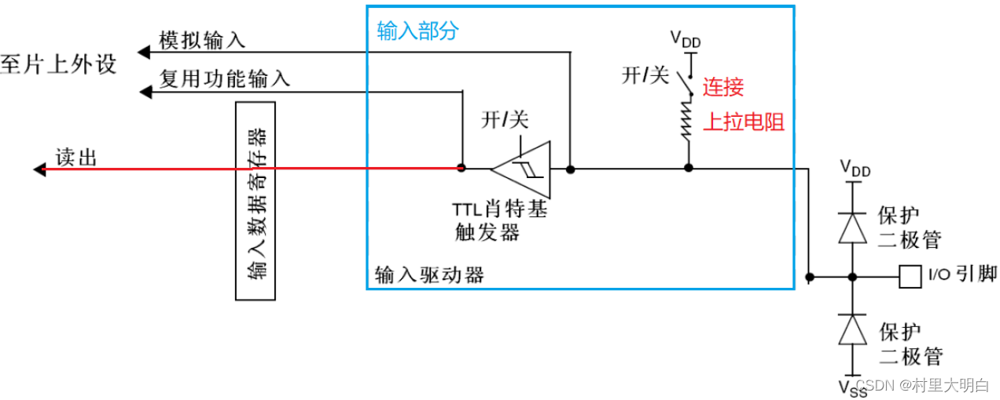
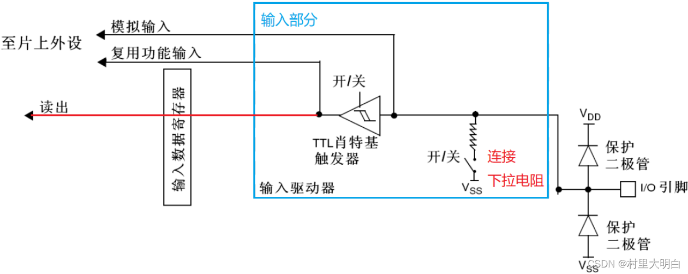
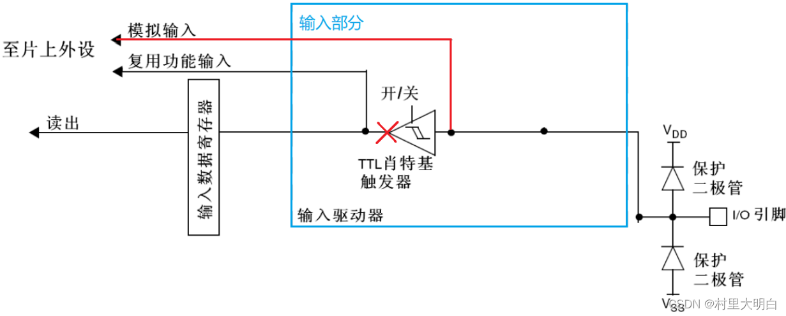
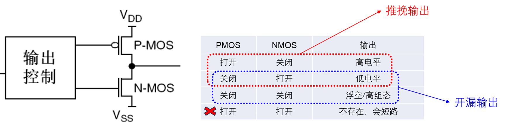
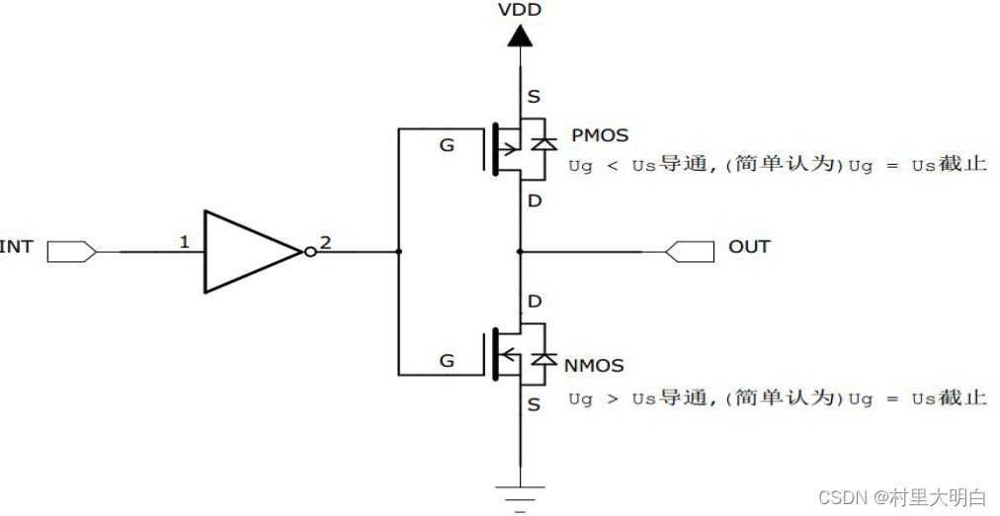
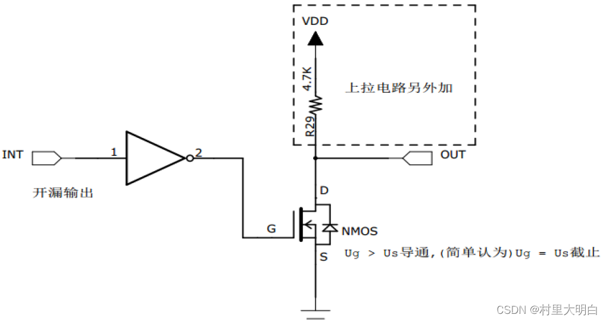
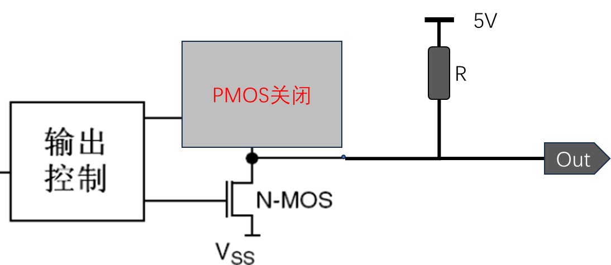
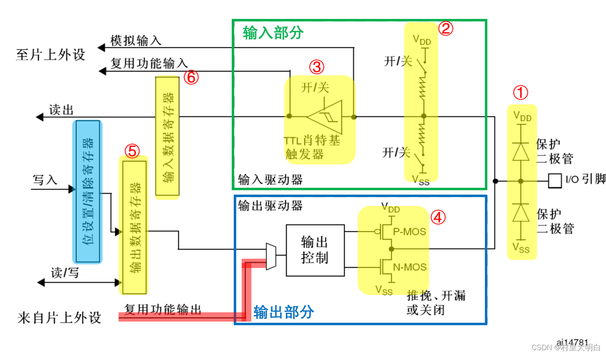

+++
title = 'STM32外设之GPIO'
date = 2026-04-25T00:12:38+08:00
categories = ["嵌入式","单片机","STM32"]
+++

参考文档：[STM32单片机自学教程_stm32教程-CSDN博客](https://blog.csdn.net/weixin_42109443/article/details/137303466?ops_request_misc=%7B%22request%5Fid%22%3A%22422bc058503681afd8ab2f949b85ba8c%22%2C%22scm%22%3A%2220140713.130102334..%22%7D&request_id=422bc058503681afd8ab2f949b85ba8c&biz_id=0&utm_medium=distribute.pc_search_result.none-task-blog-2~all~top_positive~default-1-137303466-null-null.142^v100^pc_search_result_base9&utm_term=stm32教程&spm=1018.2226.3001.4187)

我认为GPIO是最基础也是最重要的一个外设

## 1. GPIO基本结构

右边I/O 引脚是我们可以看到的芯片实物的引脚，其余部分均为GPIO 的内部结构。 

**① 保护二极管**
 👉 不参与模式选择，只负责保护引脚（所有模式都有）

> 引脚两端接到 VDD / VSS，用于防止过高或过低电压损坏芯片。但只能承受小电流，大电压仍可能烧毁。

**② 上拉/下拉电阻**
 👉 决定**输入模式**是不是“上拉 / 下拉 / 浮空”\

> 上拉 → 默认高电平	下拉 → 默认低电平	
>
> 都关 → 浮空（电平不确定）
> 属于弱上拉/下拉，大电流需外接。

**③ 输入缓冲（施密特触发器）**
 👉 决定能不能当“输入用”（所有输入模式都要它）

> 在输入模式时，施密特触发器打开，输出被禁止，可通过输入数据寄存器GPIOx_IDR读取I/O状态

- 且经过施密特触发器后信号**只有0、1两种状态**，关闭用来模拟输入

**④ 输出驱动（PMOS+NMOS）**
 👉 决定能不能“输出”，以及是**推挽还是开漏**

**⑤ 输出数据寄存器（ODR）**
 👉 决定输出是高电平还是低电平（写0/1）

**⑥ 输入数据寄存器（IDR）**
 👉 用来读引脚电平（0/1）

### 2. GPIO工作模式

按**输入**，**输出**和**复用**功能3个大类进行描述

## 2. 输入模式

​	在输入模式时，**施密特触发器打开**，输出被禁止，可通过输入数据寄存器GPIOx_IDR**读取I/O状态**。其中输入模式，可设置为**上拉、下拉、浮空和模拟**输入四种。

#### 2.1 输入浮空

上拉/下拉电阻的**开关都断开**，施密特触发器打开。IO口的电平完**全是由外部电路决定**，通常用于按键检测

#### 2.2 输入上拉

上拉电阻导通，施密特触发器打开。

👉**输入上拉 = 默认高电平，外部拉低触发**

> 在需要外部上拉电阻的时候，可以使用内部上拉电阻，这样可以节省一个外部电阻，但是内部上拉电阻的阻值较大，所以只是“弱上拉”，不适合做电流型驱动。

#### 2.3 输入下拉

 下拉电阻导通，施密特触发器打开

👉 **给引脚一个默认低电平（0）**不能做驱动，理由同上拉

#### 2..4 模拟输入

下上下拉电阻断开，施密特触发器关闭

> 关掉所有数字电路，让引脚直接连到模拟电路，**因为经过施密特触发器后信号只有0、1两种状态**

## 3. 输出模式

**主要是由双MOS管的开闭控制来实现的**

#### ⭐3.1 推挽输出——3.3V 高电平输出

​	单片机IO**只需提供逻辑控制信号**，通过内部MOS管将引脚切换连接到VCC或GND，使输出电平接近电源电压，并**具备较强的驱动能力**。

| INT输入 | 反相器输出（到MOS栅极） | PMOS状态 | NMOS状态 | OUT输出     |
| ------- | ----------------------- | -------- | -------- | ----------- |
| 0       | 1                       | 截止     | 导通     | 0（低电平） |
| 1       | 0                       | 导通     | 截止     | 1（高电平） |

#### ⭐3.2 开漏输出——低电平输出、高电平需要外部上拉

​	单片机IO只提供控制信号，通过内部NMOS管将引脚拉到GND实现低电平；当NMOS关闭时，引脚处于高阻态，**需要依靠外部上拉电阻将电平拉到VCC**，从而实现高电平输出。

| INT输入 | 反相器输出（到NMOS） | NMOS状态 | OUT状态          |
| ------- | -------------------- | -------- | ---------------- |
| 0       | 1                    | 导通     | 0（被拉到GND）   |
| 1       | 0                    | 截止     | 1（被上拉到VCC） |

#### 对比表格——推挽和开漏

| 项目             | 推挽输出            | 开漏输出                            |
| ---------------- | ------------------- | ----------------------------------- |
| 输出高电平       | 内部PMOS主动拉到VCC | ❌ 不能主动输出                      |
| 输出低电平       | 内部NMOS主动拉到GND | NMOS主动拉低                        |
| 是否需要上拉电阻 | ❌ 不需要            | ✅ 必须（外部或内部）                |
| 输出能力         | 强（高低都强）      | 低（高电平弱）                      |
| 结构             | PMOS + NMOS         | 只有NMOS                            |
| 典型应用         | LED、PWM、普通IO    | I2C、总线、多设备连接、需要更高电压 |

#### ⭐开漏输出模式的应用场景

**1. 电平不匹配，需要更高的电压驱动外设 **

​	**STM32输出的高电平是3.3V**

​	如果外部需要更高或者更低的电压，那么推挽输出就不合适了。此时就可以在**外部接一个上拉电阻**，上拉电源为外部需要的电压，如5V，并且把GPIO设置为开漏模式，当输出高阻态时，由上拉电阻和电源向外输出5伏的电平，输出低电平时则输出低电平0V。

  **2. 需要“线与”功能的总线电路** 

​	I2C、总线

​	多设备连接：每个设备输入能力不同，**设备的高电平不一定能导通PMOS**

​	多个控制器**全部输入1高阻态时则为1**，只要有一个为低电平，那么整个电路就是0.此时推挽输出模式就不可以了，因为有的控制器输入1，PMOS导通，有的控制器输入0，NMOS导通，此时双MOS管都存在导通的情况，直接就短路了。

## 4 复用功能

GPIO引脚被切换给片上外设使用，**IO口只作为信号通道**，输出由外设控制，不再由ODR控制。

### 与普通GPIO的对比：

| 项目              | 普通GPIO                | 复用模式（AF）               |
| ----------------- | ----------------------- | ---------------------------- |
| **输出控制权**    | ODR寄存器（CPU写）      | 外设寄存器（UART/SPI/TIM等） |
| **输入数据来源**  | 读IDR                   | 可读IDR，也可读外设寄存器    |
| **IO作用**        | 通用输入/输出           | 作为外设信号通道             |
| **输出类型**      | 推挽 / 开漏（GPIO配置） | 推挽 / 开漏（仍由GPIO配置）  |
| **上拉/下拉**     | GPIO配置                | GPIO配置（同样有效）         |
| **输出速度/驱动** | GPIO配置                | GPIO配置（同样有效）         |
| **是否使用ODR**   | ✅ 使用                  | ❌ 不使用（无效）             |
| **信号内容来源**  | 软件（CPU）             | 硬件外设（自动产生/接收）    |
| **典型场景**      | 点灯、读按键            | UART、SPI、I2C、PWM等        |