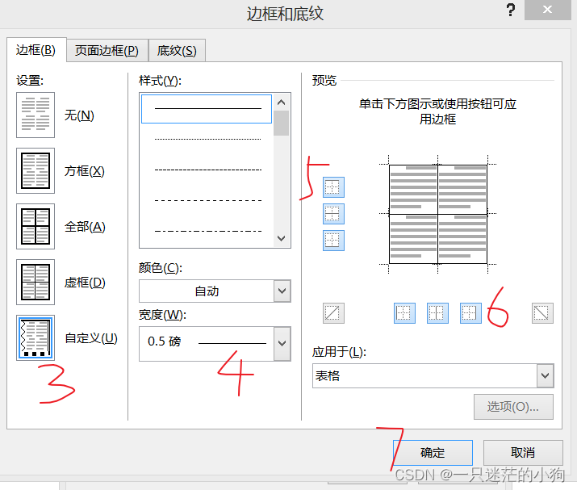

+++
title = 'Word表格怎么外框加粗内框正常'
date = 2026-05-03T00:16:53+08:00
categories = ["Word小技巧"]
+++

[怎样将word表格外框加粗 - 知乎](https://zhuanlan.zhihu.com/p/520397744)

[word中更改表格的边框粗细_word表格边框变粗怎么变回-CSDN博客](https://blog.csdn.net/qq_33300585/article/details/129207032)

​	右键表格打开表格属性，在这个界面的时候，先选择左边的宽度，再选择对应的表格位置。

​	可以对应表格位置选择对应的不同宽度。
